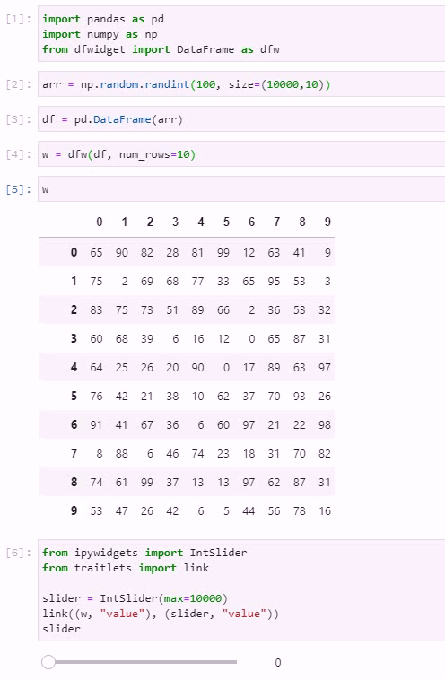
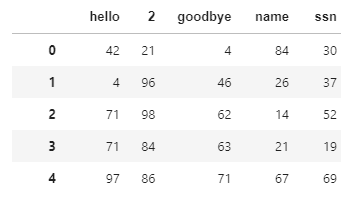

# dfwidget
IPython widget for displaying pandas DataFrames (Jupyterlab).


# Features

* Scrolling works as you would expect. 


* Clickable rows set the trait `value` to the index of the row selected. 
* Clickable headers to sort the data (only ascending at-the-moment). 
* Reset button above the `index` column.
* The auto-spacing function seems to be ok (no extensive testing). 


* Looks almost exactly like your typical `Pandas` DataFrame.


# Requirements
* ipywidgets
* nodejs
* ipyevents
* pandas

Prerequisites
```bash
pip install jupyterlab
pip install ipywidgets
pip install nodejs
pip install ipyevents
jupyter labextension install @jupyter-widgets/jupyterlab-manager
jupyter labextension install @jupyter-widgets/jupyterlab-manager ipyevents
pip install pandas
```

Installing `dfwidget`. 
From the package root...
```
pip install .
```

Alternatively, you could just copy and paste `src/dfwidget/main.py` wherever you want it so long as you have `ipyevents` working.


 
